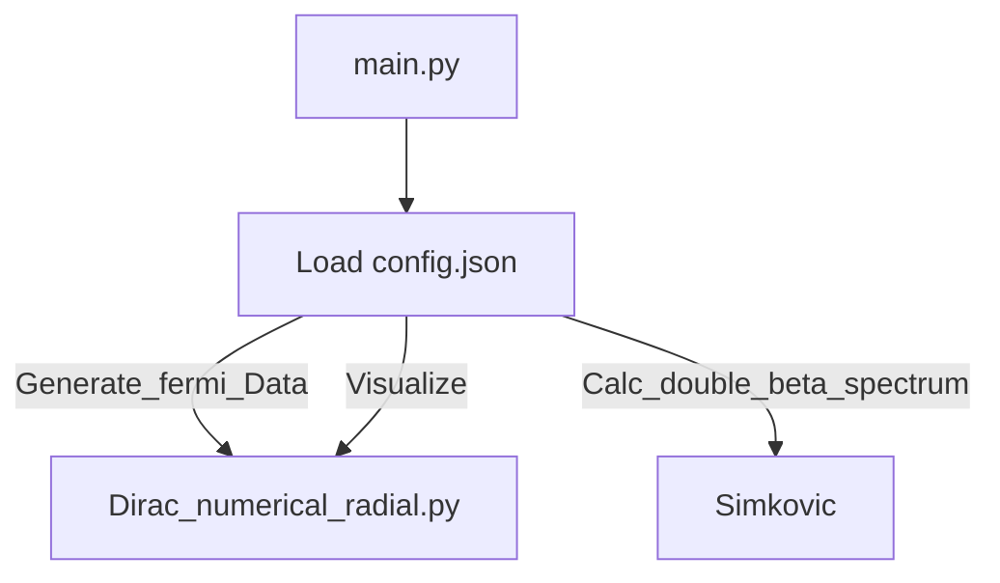

# BBKING: A Nuclear Second Order Weak Interaction Calculator
The BBKING program's main goal is to calculate the decay rate, energy spectrum, and angular correlation for nuclear second order weak interaction such as 2nuBB or 0Nbb. The program uses the description introduced by Simkovic et al (citation here) to calculate the spectra and ported the relevant components of the RADIAL Fortran (citation here) package to Python to treat the Coulomb interaction between the electrons and nucleons.

The user specifies what kind isotope, nuclear model, and electromagnetic model they are interested in generating through .json input files. The program then sets up the electromagnetic correction after which it sets up the differential decay rate with respect to the total electron kinetic energy, the normalized electron kinetic energy difference, and the cos(theta) between the two electrons. For the user's convenience plots and and separate files are also generated of only the energy spectrum and nagular correlation as is found in the work of Nitescu et al. 

The program includes the NME models of the Quasi Random Phase Approximation (QRPA), Nuclear Shell Model (NSM), and Intermediate Boson Method (IBM) due to their popularity. The program also allow the user to add higher order corrections such as the radiative corrections in the large intermediate energy limit, the pion exchange corrections, and the weak magnetic correction.

(Add Diagram of how functions are split up)

(add table that explains every single option in the json in a sentence. The pdf is for the gross details)

Write main.py file that takes a json file as an input and make an example of a json file where the user can specify the shared basename of the outputfolder (ProjectName) and certain critical inputs for simulation such what ElectroStaticMethod: Analytic or via Radial, and then allow the user to set what electrostatic model they want to use (point source or finite size), and what the nuclear charge should be (for xe136 this is -56) . Once the main py is done the program will print it is done  as a confirmation and generate a .txt file with the energy spectrum and the decay rate of xe136 w.r.t. Simkovic 2018ś inputs (to be expanded later). The files should be separated based on use, such as keeping the radial code separate from the calculation of the 2nbb observables using said function (scripts ought to talk)

Also document stuff

Is this the kind of flow diagrams we want?

