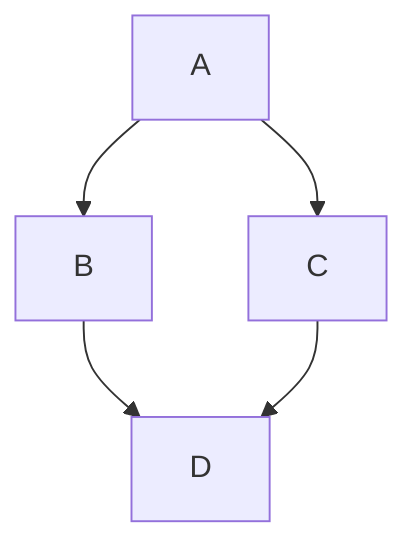

Write main.py file that takes a json file as an input and make an example of a json file where the user can specify the shared basename of the outputfolder (ProjectName) and certain critical inputs for simulation such what ElectroStaticMethod: Analytic or via Radial, and then allow the user to set what electrostatic model they want to use (point source or finite size), and what the nuclear charge should be (for xe136 this is -56) . Once the main py is done the program will print it is done  as a confirmation and generate a .txt file with the energy spectrum and the decay rate of xe136 w.r.t. Simkovic 2018ś inputs (to be expanded later). The files should be separated based on use, such as keeping the radial code separate from the calculation of the 2nbb observables using said function (scripts ought to talk)

Also document stuff

Is this the kind of flow diagrams we want?

